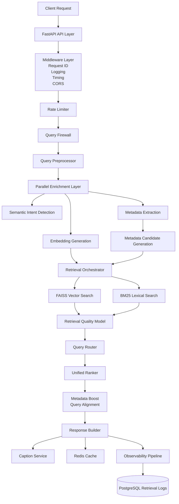

# AsanClip RAG System - Architecture

## 1. Overview

**AsanClip** is a production-grade **Hybrid RAG Search Engine** designed for intelligent video template discovery.

The system enables users to search thousands of video templates using natural language queries in Persian and English. It combines semantic retrieval, lexical matching, metadata intelligence, security validation, dynamic routing, and multi-stage ranking to provide high-quality search results with production-level reliability.

The architecture is designed around four main principles:

* **Relevance**: Retrieve the most semantically and contextually appropriate templates.
* **Safety**: Protect the system from abuse, injection attempts, and low-quality queries.
* **Observability**: Provide complete execution tracing for debugging and continuous improvement.
* **Performance**: Control latency and infrastructure cost through intelligent routing and caching.

---

# 2. High-Level Architecture



---

# 3. Request Lifecycle

Each search request follows a complete observable pipeline:

## Step 1 - API Layer

Responsibilities:

* Request validation
* Authentication/session tracking
* Request ID generation
* Middleware execution
* Rate limiting

Main components:

```
main.py
api/routes.py
middleware/
```

---

## Step 2 - Query Firewall Layer

The firewall is the first decision point before expensive operations.

Location:

```
firewall/
 ├── query_firewall.py
 ├── abuse_detector.py
 ├── injection_detector.py
 ├── cost_controller.py
 ├── query_validator.py
 └── semantic_intent.py
```

Responsibilities:

### Security Protection

* Prompt injection detection
* Dangerous command detection
* Abuse prevention
* Spam detection

### Query Quality Protection

* Low information queries
* Invalid patterns
* Very short meaningless queries
* Low semantic confidence

### Cost Control

The cost controller prevents uncontrolled resource usage by tracking:

* Daily usage
* Query cost units
* Expensive operations

Example decision:

```
Allowed:
{
 cost_units: 1,
 used_today: 59,
 daily_limit: 1000
}
```

---

# 4. Query Processing Layer

## Query Preprocessor

Location:

```
services/query_preprocessor.py
```

Responsibilities:

* Unicode normalization
* Persian character normalization
* Digit normalization
* Symbol cleanup
* Text standardization

---

# 5. Parallel Enrichment Layer

To reduce latency, independent operations run in parallel.

Components:

```
Metadata Extraction
Semantic Intent Detection
Embedding Generation
```

Implemented using parallel execution strategies.

Benefits:

* Reduced blocking
* Better throughput
* Independent failure handling

---

# 6. Semantic Intent Understanding

Location:

```
firewall/semantic_intent.py
```

The semantic layer determines whether a query represents a valid template search intent.

Capabilities:

* Product type detection
* Occasion extraction
* Platform detection
* Product name matching
* Domain-specific intent recognition

Example:

Query:

```
کلیپ تبریک سالگرد ازدواج
```

Detected:

```
product_name:
ساخت کلیپ تبریک سالگرد ازدواج

confidence:
1.0396
```

The semantic layer improves:

* Retrieval precision
* Metadata filtering
* Query routing decisions

---

# 7. Retrieval Architecture

The retrieval system follows a multi-stage strategy.

Location:

```
retrieval/

├── vector_search.py
├── bm25_search.py
├── faiss_index.py
├── metadata_search.py
├── hybrid_filter.py
└── retrieval_orchestrator.py
```

---

## 7.1 Vector Retrieval

Technology:

```
FAISS
```

Purpose:

Capture semantic similarity.

Example:

Query:

```
کلیپ عشق برای همسر
```

Can retrieve:

```
سالگرد ازدواج
ولنتاین
کلیپ عاشقانه
```

even without exact keyword matching.

---

## 7.2 Lexical Retrieval

Technology:

```
BM25
```

Purpose:

Capture exact keyword matching.

Useful for:

* Product names
* Specific terms
* Rare keywords

---

## 7.3 Hybrid Retrieval

The system combines:

* Dense semantic similarity
* Lexical overlap
* Metadata compatibility

Retrieval modes:

```
Vector
Hybrid
Lexical
```

---

# 8. Dynamic Retrieval Routing

Location:

```
routing/

query_router.py
```

The router selects the retrieval strategy based on quality signals.

Signals:

* Top similarity score
* Top-k density
* Result margin
* Token overlap
* Retrieval confidence

Example:

```
retrieval_quality_score: 0.837

decision:
vector

reason:
retrieval_quality_says_vector
```

---

# 9. Retrieval Quality Evaluation

Location:

```
services/retrieval_quality.py
```

The quality model evaluates retrieved candidates.

Tracked signals:

```
top1 similarity
top2 similarity
margin
density
overlap
top-k mean
```

If quality is insufficient:

```
Vector
   ↓
Hybrid
   ↓
Lexical
```

Fallback occurs.

---

# 10. Ranking Pipeline

Location:

```
ranking/

├── unified_ranker.py
├── metadata_boost.py
└── score_normalizer.py
```

Ranking is responsible for final ordering.

Pipeline:

```
Raw Retrieval Scores

        ↓

Score Normalization

        ↓

Metadata Boosting

        ↓

Query Alignment Boost

        ↓

Unified Ranking Score
```

---

## Ranking Features

The final score considers:

### Vector Similarity

Semantic relevance.

### Lexical Score

Exact keyword relevance.

### Metadata Alignment

Matching:

* occasion
* product type
* platform

### Query Alignment

Direct query-template relationship.

Example:

```
query_alignment_boost: 0.35
```

---

# 11. Response Building

Location:

```
builders/
services/caption_service.py
```

Responsibilities:

* Format final response
* Attach template metadata
* Generate suggested captions
* Remove internal observability fields

Returned information:

* Template ID
* Template name
* Ranking score
* Suggested captions
* Metadata

---

# 12. Observability Architecture

Observability is a core design component.

Locations:

```
analytics/

event_builder.py
logger.py
metrics.py
repository.py
```

Every request creates a complete execution trace.

---

## Logged Information

### Request Information

```
request_id
session_id
query_hash
language
query length
token count
```

---

### Firewall Information

```
blocked
block reason
security signals
validation score
cost decision
```

---

### Semantic Information

```
best matched field
semantic score
detected intent
metadata extraction
```

---

### Retrieval Information

```
selected mode
route reason
quality score
attempt history
fallback status
candidate count
```

---

### Ranking Information

```
top result
final score
component scores
boost factors
```

---

### Business Feedback

The system supports future learning loops through:

```
clicked_result
clicked_position
purchased
user_feedback
manual_relevance_label
```

---

# 13. Production Latency Analysis

Latency targets must be based on real telemetry.

Current observed production latency:

```
Total latency:
~3.2s - 4.5s

Main contributors:

Firewall/Semantic validation:
~1.5s - 1.8s

Remaining pipeline:
~1.5s - 2s
```

Retrieval itself is highly optimized:

Observed retrieval execution:

```
~20ms - 30ms
```

Therefore optimization priority:

1. Firewall optimization
2. Semantic cache
3. Embedding reuse
4. Async enrichment
5. Retrieval optimization


---

# 14. Performance Optimization Strategy

Implemented optimizations:

## Parallel Execution

Independent operations execute concurrently.

---

## Early Rejection

Invalid requests are rejected before:

* embedding generation
* retrieval
* ranking

---

## Candidate Pruning

Metadata filtering reduces retrieval search space.

---

## Redis Cache Layers

Implemented cache strategies:

### Query Result Cache

Stores complete search responses.

### Embedding Cache

Avoids repeated embedding generation.

### Metadata Cache

Stores static metadata.

---

# 15. Scalability Design

The architecture supports horizontal scaling.

## Stateless API

FastAPI workers can scale independently.

---

## Shared Infrastructure

Components:

```
Redis
PostgreSQL
FAISS Index
Embedding Service
```

---

Future improvements:

* Dedicated retrieval service
* Async workers
* Background index refresh
* Distributed vector database

---

# 16. Database Architecture

Technology:

```
PostgreSQL
SQLAlchemy
```

Main entities:

```
RetrievalLog
ProductCaption
FirewallDailyUsage
```

Optimization:

* Metadata indexes
* Composite indexes
* Retrieval trace storage
* Analytics queries

---

# 17. Continuous Improvement Loop

The system is designed for continuous optimization.

Collected signals:

```
Query
↓
Retrieved Candidates
↓
Clicked Result
↓
Purchased Template
↓
Human Feedback
```

Used for:

* Ranking improvement
* Retrieval evaluation
* Hard negative mining
* Dataset generation
* A/B testing

---

# 18. Code Organization

Project structure follows modular production architecture:

```
app2/

analytics/
    Observability and event tracking

api/
    External API endpoints

firewall/
    Security and query validation

embedding/
    Embedding generation

metadata/
    Metadata extraction

retrieval/
    Vector, BM25 and hybrid retrieval

routing/
    Dynamic retrieval decisions

ranking/
    Ranking and score fusion

services/
    Business orchestration

cache/
    Redis caching

db/
    Database models and sessions

repositories/
    Data access layer

scripts/
    Index building and maintenance

tests/
    Automated testing
```

---

# 19. Key Design Decisions

## Why Hybrid Retrieval?

Dense retrieval provides semantic understanding.

BM25 preserves exact keyword matching.

Together they improve recall and precision.

---

## Why Firewall Before Retrieval?

Because invalid queries should not consume expensive resources.

Security and cost control happen before retrieval.

---

## Why Multi-stage Ranking?

Retrieval maximizes recall.

Ranking maximizes precision.

Separating these responsibilities improves quality.

---

## Why Rich Observability?

Production RAG systems require visibility into:

* failures
* latency bottlenecks
* ranking behavior
* user satisfaction

The observability layer enables debugging, experimentation, and continuous improvement.

---

# Summary

AsanClip is a production-oriented Hybrid RAG Search Engine combining:

* Semantic search
* Lexical retrieval
* Metadata intelligence
* Dynamic routing
* Multi-stage ranking
* Security controls
* Cost management
* Full observability

The architecture is designed to evolve from a single-service RAG application into a scalable AI search platform.
