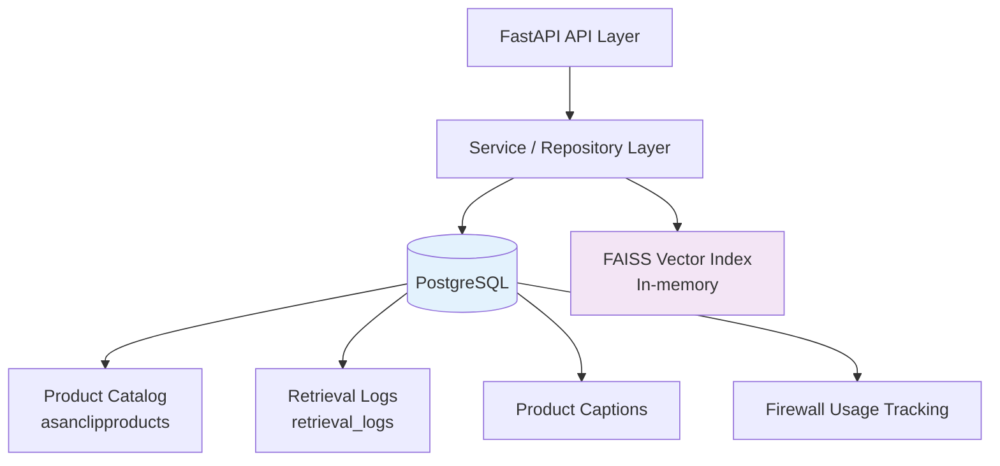
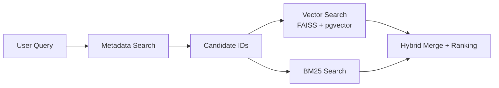

# AsanClip RAG System - Database Architecture

## 1. Overview

The AsanClip database layer is designed to support a **production-grade Hybrid RAG Search Engine** for video template discovery.

**PostgreSQL** serves as the central operational database, responsible for:

- Product catalog storage
- Metadata-driven retrieval
- Caption management
- Comprehensive search observability
- Security and cost tracking
- Feedback collection for future ML improvements

The database design is optimized for:

- Fast retrieval filtering
- Full pipeline traceability
- Continuous evaluation
- Dataset generation
- Production monitoring


---

# 2. Database Architecture Overview



The database architecture follows a **separation of concerns** approach:

- PostgreSQL manages persistent business data and observability data.
- FAISS provides low-latency semantic retrieval.
- Service and repository layers isolate database operations from the API layer.
- Retrieval logs create a foundation for future ML optimization.


---

# 3. Core Database Tables

## 3.1 Product Catalog Table (`asanclipproducts`)

### Purpose

The `asanclipproducts` table is the **main source of truth** for all searchable video templates.

It stores:

- Template metadata
- Searchable content representation
- Retrieval-related information
- Product availability status


### Key Field Groups

### Identity & Content

Main fields:

- `id`
- `name`
- `short_description`
- `description`

### RAG Search Representation

- `rag_text`

`rag_text` is a normalized searchable representation combining:

- Product type
- Occasion
- Platform
- Title
- Description
- Additional metadata

This field is optimized for semantic retrieval and hybrid search.


### Metadata Fields

Used for fast filtering and candidate generation:

- `product_type`
- `occasion`
- `platform`
- `tags`
- `category`


### Retrieval Related Fields

- `embedding_vector`  
  - Vector representation used for similarity search.
  - Stored using `pgvector`.

- `tag_status`
  - Used to filter only valid and searchable content.


---

# 3.2 Product Captions Table (`product_captions`)

## Purpose

Stores AI-generated and curated captions associated with video templates.

The table supports:

- Smart caption recommendations
- Occasion-aware suggestions
- Future ranking improvements
- Personalized content generation


## Main Fields

- `product_id`
- `caption_text`
- `caption_type`
- `occasion_category`
- `priority`
- `is_active`


---

# 3.3 Retrieval Logs Table (`retrieval_logs`)

## Purpose

`retrieval_logs` is the most critical observability table.

It provides complete traceability for every search request.

The table is designed for:

- Debugging retrieval failures
- Monitoring production quality
- Measuring latency and cost
- Building future ML datasets


## Stored Information


## Query Information

Tracks user search behavior:

- `request_id`
- `session_id`
- `user_id`
- Raw query
- Normalized query
- Query hash
- Token count
- Language


## Firewall & Security Signals

Tracks malicious or invalid requests:

- `blocked`
- `block_reason`
- `firewall_signals`
- Validation score
- Injection signals
- Abuse detection signals


## Semantic Understanding

Stores semantic analysis results:

- `semantic_best_field`
- `semantic_best_score`
- Full semantic matching information


## Retrieval & Routing

Tracks retrieval decisions:

- `mode`
- `route_reason`
- `retrieval_quality_score`
- Retry history
- Fallback usage
- Candidate count


## Ranking & Search Results

Stores ranking information:

- `top_result_id`
- `top_result_score`
- `top_results`

Including:

- Vector similarity score
- Lexical score
- Metadata matching score
- Overlap score


## Performance Metrics

Detailed latency breakdown:

- `latency_firewall_ms`
- `latency_embedding_ms`
- `latency_retrieval_ms`
- `latency_ranking_ms`
- `latency_total_ms`


## Cost & Cache Tracking

Tracks:

- Token estimation
- Daily usage
- `cache_hit`


## Future Learning Signals

Collected for ML improvement:

- `manual_intent_label`
- `manual_relevance_label`


---

# 4. Database Access Patterns

## Metadata Loading (`metadata_loader.py`)

At application startup, metadata values are loaded from PostgreSQL.

Examples:

- Product types
- Occasions
- Platforms
- Product names

These values are used to build semantic catalogs for query understanding.


---

## Metadata Candidate Generation

Before expensive retrieval operations:

1. Metadata filtering is performed.
2. Candidate product IDs are generated.
3. Vector and lexical search operate only on relevant candidates.

Benefits:

- Reduced search space
- Lower latency
- Lower computational cost


---

## Retrieval Flow




---

# 5. Indexing Strategy

## Metadata Indexes

Indexes are created for frequently filtered fields:

- `product_type`
- `occasion`
- `platform`
- `tag_status`


---

## Observability Indexes

Optimized for monitoring and analytics:

- `created_at + mode`
- `created_at + blocked`
- `cache_hit + created_at`
- `request_id` (unique)
- `retrieval_quality_score`


---

## Full-Text Search Index

A GIN index is used on:

- `name`
- `description`
- `rag_text`

using PostgreSQL `tsvector`.


---

## Vector Search Index

Hybrid vector retrieval uses:

- `pgvector` index inside PostgreSQL
- FAISS in-memory index for high-speed semantic search


---

# 6. Performance Design

## Key Optimizations

The database layer applies multiple production optimizations:

- Candidate pruning before vector/BM25 search
- Connection pooling with `pool_pre_ping`
- Cached metadata loading
- Parameterized queries
- Strategic FAISS usage for fast retrieval path
- PostgreSQL vector search as fallback and persistent storage


---

# 7. Security Design

Security principles:

- No direct database access from API layer
- All queries pass through repository/service layers
- Parameterized SQL queries only
- Security events stored in retrieval logs
- Firewall usage tracked separately
- Controlled write operations


---

# 8. Data Collection for Future ML Improvements

The database is intentionally designed to collect high-quality production signals.

## Future Learning Pipeline

```
Production Logs
        |
        v
Data Cleaning
        |
        v
Golden Dataset Generation
        |
        v
Model Training
(Intent Classifier, Router, Reranker)
```


## Key Signals Collected

- Semantic matches vs actual user interactions
- Failed or rejected queries
- Manual relevance labels
- Intent labels
- User feedback signals


These signals enable continuous improvement of:

- Query understanding
- Retrieval routing
- Ranking models
- Personalization


---

# 9. Scalability Roadmap

## Current Architecture

- Single PostgreSQL instance
- FAISS index per worker
- Redis caching layer


---

## Future Scaling Plan

Potential improvements:

- Partitioning `retrieval_logs` by time
- PostgreSQL read replicas for analytics workloads
- Dedicated vector database if scale requires
- Automated indexing optimization
- Continuous evaluation pipelines
- Learned retrieval routing


---

# 10. Database Versioning

## Current Version

```
v1.0 - Production Foundation
```

Focus areas:

- Retrieval Quality
- Security
- Observability
- Data Collection


---

## Next Version

```
v2.0 - Data Driven Optimization
```

Planned capabilities:

- Golden dataset generation
- Automated evaluation framework
- Learned routing models
- Neural reranking models
- Continuous retrieval optimization